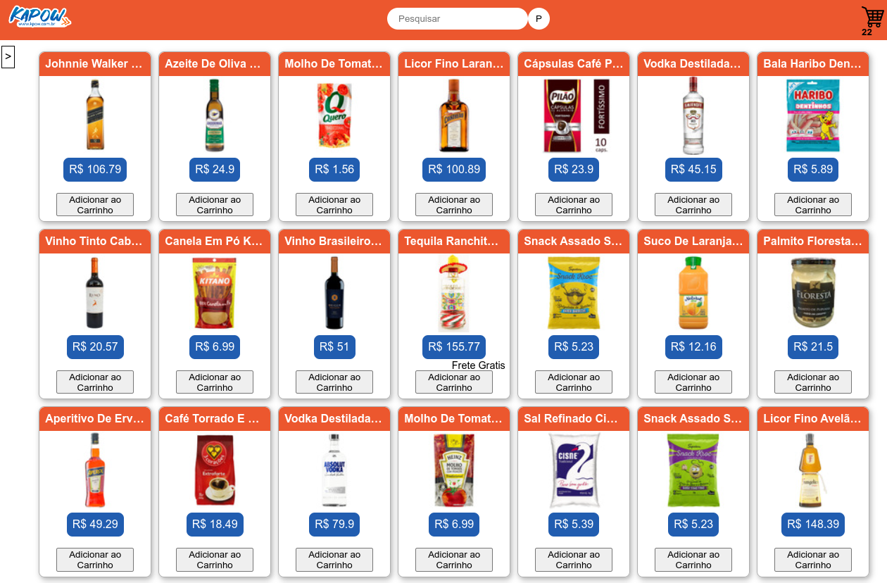

# Frontend Online Store

## Introdução
Um projeto que simula uma loja usando a api do mercado livre.

Esse projeto foi feito em grupo com [Helder Daniel](https://github.com/helderdsa), [Rafael Almeida](https://github.com/RafaelFAlm), [Silmar Lessa](https://github.com/SilmarLessa), [Diego Mello](https://github.com/diegomello).

O projeto todo, menos a parte do css, foi feito em pair programming, todos os integrantes do grupo contribuíram para o funcionamento da lógica da aplicação.

Eu e o Helder fizemos a parte do css, ele que teve a idéia de fazer um estilo baseado no site Kabum.

## Funcionamento
O funcionamento é bem simples, é so selecionar uma categoria ou fazer uma busca que os itens irão aparecer. Esses itens podem ser adicionados ao carrinho.

## Link da aplicação
https://frontend-online-store-red.vercel.app/

## Imagem da aplicação

